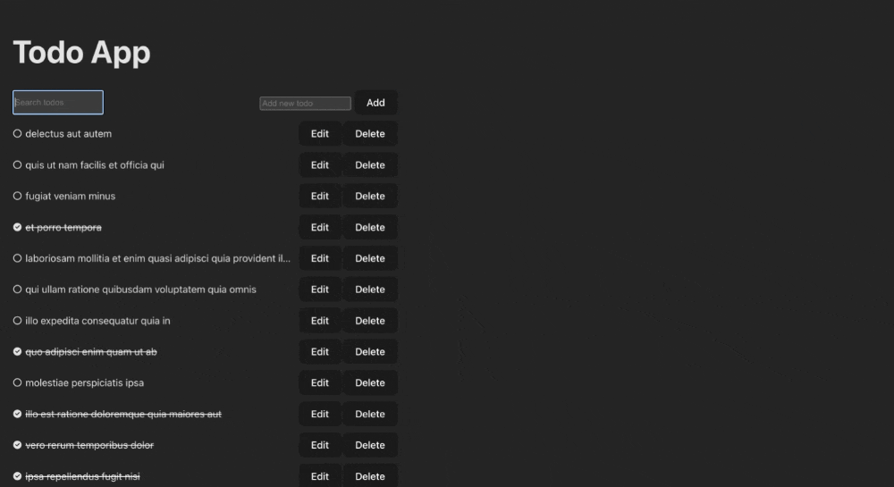

# ToDo App

This is a simple ToDo application built with React and Vite. It allows users to manage their tasks, mark them as completed, edit them, delete them, and search for specific tasks. The application also features animations for a smoother user experience.

## Screenshots / Preview



## Features

- Add, edit, and delete tasks/todos.
- Mark tasks/todos as done/completed.
- Utilize a search bar to find specific tasks/todos.
- Animations for marking, deleting, and editing tasks/todos.
- Unit testing for components.

## Installation

1. Clone the repository:

```bash
git clone https://github.com/akmalmstfa29/todo-app-react todo-app
```

2. Navigate to the project directory:

```bash
cd todo-app
```

3. Install dependencies:

```bash
yarn install
```

## Usage

1. Start the development server:

```bash
yarn dev
```

2. Open the browser and navigate to `http://localhost:5173`.

3. Start managing your tasks!

## Testing

To run unit tests, use the following command:

```bash
yarn test
```

## Technologies Used

- React
- Vite
- PropTypes
- Vitest
- React Testing Library
- Frammer Motion
